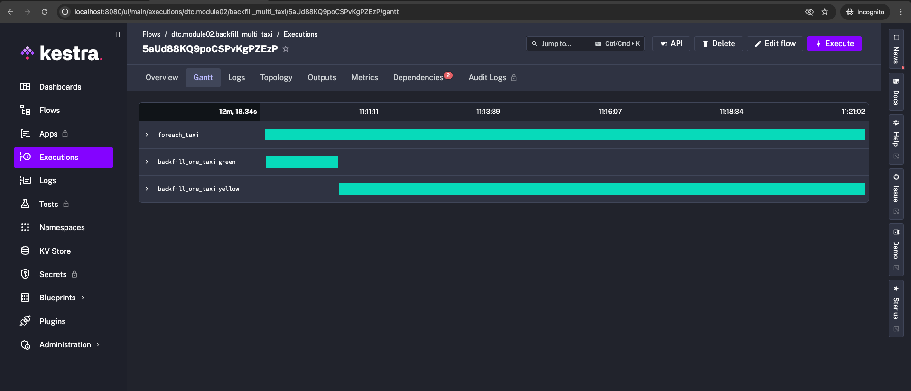
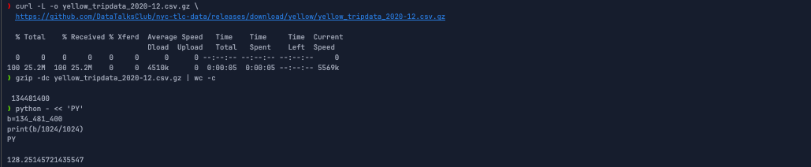
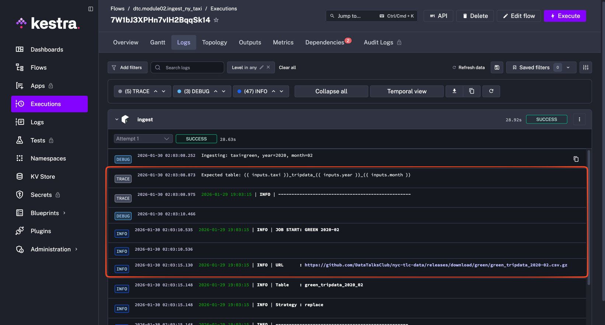
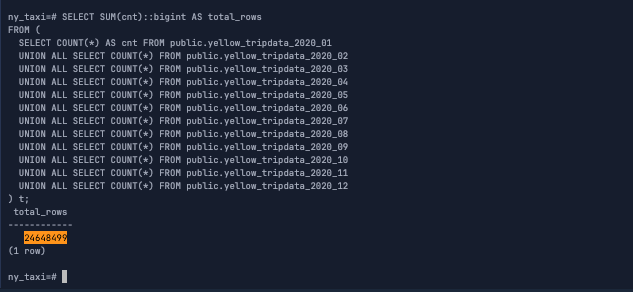
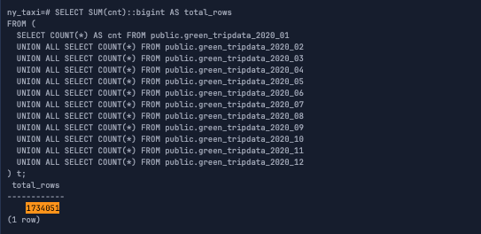
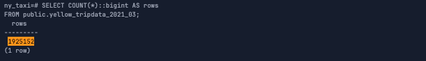
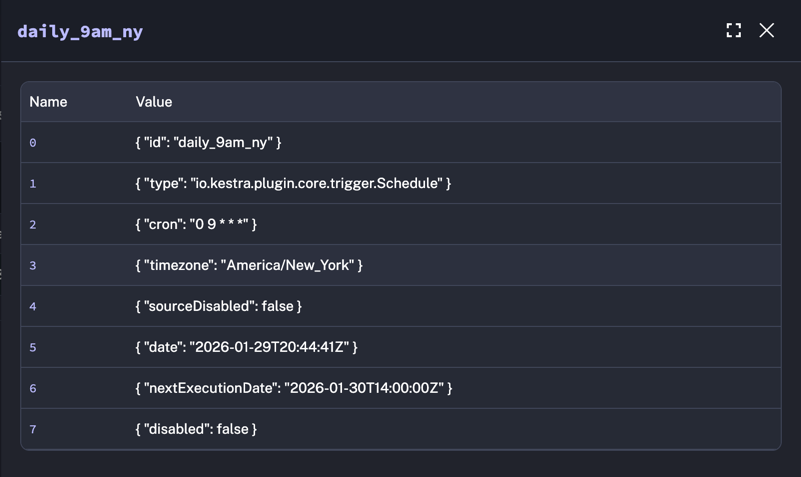

<div align="center">

# Module 02 — Workflow Orchestration (Kestra) + Postgres (NYC Taxi)


</div>

<br/>

This module provides a local stack for **NYC TLC Taxi ingestion** orchestrated by **Kestra** and loaded into a **Postgres** warehouse.

The ingestion step runs inside the Docker image built in **Module 01** (`ENV_INGEST_IMAGE`, e.g. `ingestion_pipeline:v1.0.1`).  
The Python app follows a safe load pattern:

<div align="center">

**download → staging → validation → atomic swap → analyze**  
_Uses staging + validation and performs an atomic table swap for `IF_EXISTS=replace`, avoiding partial cutovers._

</div>


---

## Contents

- [Project structure](#project-structure)
- [Prerequisites](#prerequisites)
- [Configuration](#configuration)
- [Quick start](#quick-start)
- [Running the stack](#running-the-stack)
- [Access](#access)
- [Services overview](#services-overview)
- [Kestra flows](#kestra-flows)
- [Verification](#verification)
- [Troubleshooting](#troubleshooting)
- [Data source](#data-source)
- [Homework evidence](#homework-evidence)
- [Local smoke test (Kestra → Postgres)](#local-smoke-test-kestra--postgres)


---

## Project structure

```text
02-workflow-orchestration
├── .env
├── .env.example
├── 02-README.md
├── docker-compose.yml
├── flows
│   ├── 01_ingestion
│   │   ├── backfill_months_for_taxi.yml
│   │   ├── backfill_multi_taxi.yml
│   │   └── ingest_ny_taxi.yml
│   └── 02_ops
│       └── schedule_timezone_newyork.yml
└── homework
    ├── homework_02.sql
    └── screenshot
```
---

## Prerequisites

* Docker Desktop / Docker Engine
* (Optional) `psql` (to verify the target database)

---

## Configuration

### 1) Create `.env`

```bash
cp .env.example .env
```

### 2) Key environment variables

This stack uses **two Postgres** instances:

* `pgdatabase` → **target warehouse DB** (NY Taxi tables)
* `kestra_postgres` → **Kestra metadata DB**

#### Target DB (warehouse) settings

* `DB_USER`, `DB_PASSWORD`, `DB_NAME`, `DB_SCHEMA`
* `DB_PORT` *(host port only: laptop → container 5432)*

#### Flow runtime (used by Kestra tasks + utility container)

These are the **canonical runtime variables** used by Kestra flows via `envs.*`:

* `ENV_DB_HOST`, `ENV_DB_PORT`, `ENV_DB_USER`, `ENV_DB_PASSWORD`, `ENV_DB_NAME`, `ENV_DB_SCHEMA`
* `ENV_DOCKER_NETWORK`
* `ENV_INGEST_IMAGE`

> Note on `.env`: `env_file: [ .env ]` injects variables into the container environment, but does **not** mount the `.env` file inside the container filesystem.

---

## Quick start

```bash
# 1) create env file
cp .env.example .env

# 2) start core stack (Kestra + 2x Postgres)
docker compose up -d

# 3) open Kestra UI
open http://localhost:8080

# (optional) start tools (pgAdmin + utility container)
docker compose --profile tools up -d
```

---

## Running the stack

### Start core services (Kestra + 2x Postgres)

```bash
docker compose up -d
docker compose ps
```

### Start optional tools (pgAdmin + utility container)

```bash
docker compose --profile tools up -d
```

### Stop / reset

```bash
docker compose down
docker compose down -v
```

---

## Access

* **Kestra UI:** [http://localhost:8080](http://localhost:8080)
* **Kestra API:** [http://localhost:8081](http://localhost:8081)
* **pgAdmin (optional):** [http://localhost:${PGADMIN_PORT:-8085}](http://localhost:${PGADMIN_PORT:-8085}) *(run with `--profile tools`)*

---

## Services overview

| Service                               | Purpose                           | Ports                                                |
| ------------------------------------- | --------------------------------- | ---------------------------------------------------- |
| `pgdatabase`                          | Target warehouse (NY Taxi tables) | host `localhost:${DB_PORT:-5432}` → container `5432` |
| `kestra_postgres`                     | Kestra metadata DB                | internal only                                        |
| `kestra`                              | UI + API + worker (standalone)    | `8080`, `8081`                                       |
| `pgadmin` *(tools profile)*           | DB GUI                            | `${PGADMIN_PORT:-8085}`                              |
| `ingestionPipeline` *(tools profile)* | Utility container (debug)         | none                                                 |

### Connectivity reminder

| From                                          | To        | Host / Port                                             |
| --------------------------------------------- | --------- | ------------------------------------------------------- |
| Containers (Kestra tasks / utility container) | target DB | `ENV_DB_HOST:ENV_DB_PORT` *(default `pgdatabase:5432`)* |
| Your laptop (psql/DBeaver)                    | target DB | `localhost:${DB_PORT:-5432}`                            |

---

## Kestra flows

Flows live under `flows/`.

### Environment variable mapping in Kestra

This repo uses `ENV_*` variables in `.env` (e.g. `ENV_DB_HOST`).
In Kestra expressions, `envs.*` automatically strips the `ENV_` prefix and lowercases the rest:

* `ENV_DB_HOST` → `{{ envs.db_host }}`
* `ENV_DB_PORT` → `{{ envs.db_port }}`
* `ENV_DB_USER` → `{{ envs.db_user }}`
* `ENV_DB_PASSWORD` → `{{ envs.db_password }}`
* `ENV_DB_NAME` → `{{ envs.db_name }}`
* `ENV_DB_SCHEMA` → `{{ envs.db_schema }}`
* `ENV_DOCKER_NETWORK` → `{{ envs.docker_network }}`
* `ENV_INGEST_IMAGE` → `{{ envs.ingest_image }}`

### 1) `flows/01_ingestion/ingest_ny_taxi.yml` (single month)

Ingests a single `(taxi, year, month)` into Postgres using a Docker task runner.

**Docker runner**

* `containerImage: {{ envs.ingest_image }}`
* `networkMode: {{ envs.docker_network }}`

**Command**

```bash
python /app/main.py ingest
```

**Inputs**

| Input               | Type   |   Default | Notes                               |
| ------------------- | ------ | --------: | ----------------------------------- |
| `taxi`              | SELECT |   `green` | `yellow`, `green`                   |
| `year`              | INT    |    `2021` |                                     |
| `month`             | STRING |    `"01"` | must be 2 digits                    |
| `file_format`       | SELECT |    `csv`  | `csv`, `parquet`, `tsv`             |
| `if_exists`         | SELECT | `replace` | `replace`, `skip`, `fail`, `append` |
| `keep_local`        | BOOL   |   `false` | keep downloaded file in container   |
| `loader_chunk_size` | INT    |   `50000` | loader tuning                       |
| `loader_batch_size` | INT    |  `100000` | loader tuning                       |

Timeout: `PT45M`
Retry: exponential, max attempts: `3`

---

### 2) `flows/01_ingestion/backfill_months_for_taxi.yml` (many months, one taxi)

Backfills multiple months for a single taxi type by calling `ingest_ny_taxi` as a Subflow.

**How it works**

* `ForEach` over `inputs.months`
* `concurrencyLimit: 1` (sequential; laptop-friendly)
* `wait: true`, `transmitFailed: true` (fail-fast)

**Inputs**

| Input               | Type          |        Default | Notes                               |
| ------------------- | ------------- | -------------: |-------------------------------------|
| `taxi`              | SELECT        |        `green` | `yellow`, `green`                   |
| `year`              | INT           |         `2021` |                                     |
| `months`            | ARRAY(STRING) | `["01".."12"]` | each month must be 2 digits         |
| `if_exists`         | SELECT        |         `skip` | `skip`, `replace`, `fail`, `append` |
| `keep_local`        | BOOL          |        `false` |                                     |
| `loader_chunk_size` | INT           |        `50000` |                                     |
| `loader_batch_size` | INT           |       `100000` |                                     |

---

### 3) `flows/01_ingestion/backfill_multi_taxi.yml` (many taxis)

Backfills multiple taxi types by calling `backfill_months_for_taxi` as a Subflow.

**How it works**

* `ForEach` over `inputs.taxis`
* `concurrencyLimit: 1` (sequential)
* `wait: true`, `transmitFailed: true`

Default taxis: `["green","yellow"]`

**Inputs**

| Input               | Type          |              Default |
| ------------------- | ------------- | -------------------: |
| `taxis`             | ARRAY(STRING) | `["green","yellow"]` |
| `year`              | INT           |               `2021` |
| `months`            | ARRAY(STRING) |       `["01".."12"]` |
| `if_exists`         | SELECT        |               `skip` |
| `keep_local`        | BOOL          |              `false` |
| `loader_chunk_size` | INT           |              `50000` |
| `loader_batch_size` | INT           |             `100000` |

---

### 4) `flows/02_ops/schedule_timezone_newyork.yml` (timezone demo)

Schedule trigger example:

* cron: `0 9 * * *`
* timezone: `America/New_York`

---

## Verification

Enter `psql` inside the target DB container:

```bash
docker compose exec pgdatabase psql -U ${DB_USER} -d ${DB_NAME}
```

Examples:

```sql
\d

SELECT COUNT(*)::bigint AS rows
FROM public.yellow_tripdata_2021_03;
```

---

## Troubleshooting

### Kestra cannot resolve `envs.*` variables

Verify the Kestra container has the required `ENV_*` variables:

```bash
docker compose exec kestra env | egrep "ENV_DB_HOST|ENV_DB_PORT|ENV_DB_USER|ENV_DB_PASSWORD|ENV_DB_NAME|ENV_DB_SCHEMA|ENV_DOCKER_NETWORK|ENV_INGEST_IMAGE"
```

If you changed `.env`, recreate Kestra:

```bash
docker compose up -d --force-recreate kestra
```

### Docker network not found (Kestra Docker runner)

Check your compose network name:

```bash
docker network ls | grep dtc-module-02
```

Ensure `.env` contains the actual network name:

* `ENV_DOCKER_NETWORK=dtc-module-02_dtc-net`

### Host vs container port confusion

* Host tools (psql/DBeaver): `localhost:${DB_PORT:-5432}`
* Containers: `ENV_DB_HOST:ENV_DB_PORT` *(default `pgdatabase:5432`)*

---

## Local smoke test (Kestra → Postgres)

This run validates the end-to-end stack: **Kestra flow → Docker task runner → ingestion image → Postgres**.

**Flow**
- `backfill_multi_taxi`
- `taxis`: `["green","yellow"]`
- `year`: `2020`
- `months`: `["01","02","03"]`
- Execution: sequential (`concurrencyLimit=1`)

**Kestra runtime**
- Created: `2026-02-02 23:11:11`
- Started: `2026-02-02 23:11:12`
- Success: `2026-02-02 23:23:30`  
  → **~12m 18s**

**Row count verification (Postgres)**

```sql
SELECT
  SUM(row_count) AS total_rows
FROM (
  SELECT
    (xpath('/row/c/text()',
      query_to_xml(
        format('SELECT COUNT(*) AS c FROM %I.%I', table_schema, table_name),
        false, true, ''
      )
    ))[1]::text::int AS row_count
  FROM information_schema.tables
  WHERE table_schema = 'public'
    AND table_name LIKE '%_tripdata_2020_%'
) t;
```

Expected output:

```text
 total_rows
------------
  16781462
```

**Screenshot**


---


## Data source

NYC TLC datasets (DataTalksClub mirror):
[https://github.com/DataTalksClub/nyc-tlc-data/releases](https://github.com/DataTalksClub/nyc-tlc-data/releases)

---

## Homework evidence

Screenshots are stored in `homework/screenshot/`.

| Question | Evidence                                                                                                     |
| -------: | ------------------------------------------------------------------------------------------------------------ |
|       Q1 |  |
|       Q2 |  |
|       Q3 |  |
|       Q4 |  |
|       Q5 |  |
|       Q6 |  |
