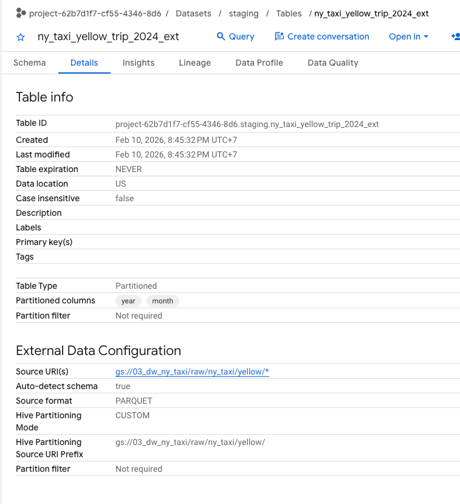
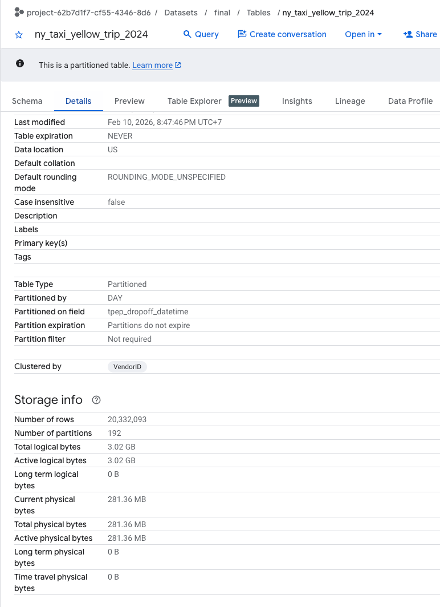
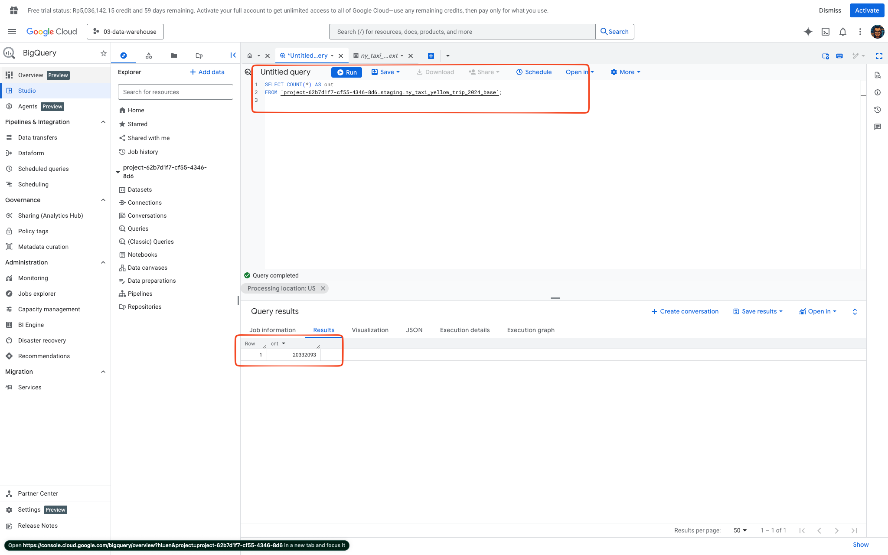
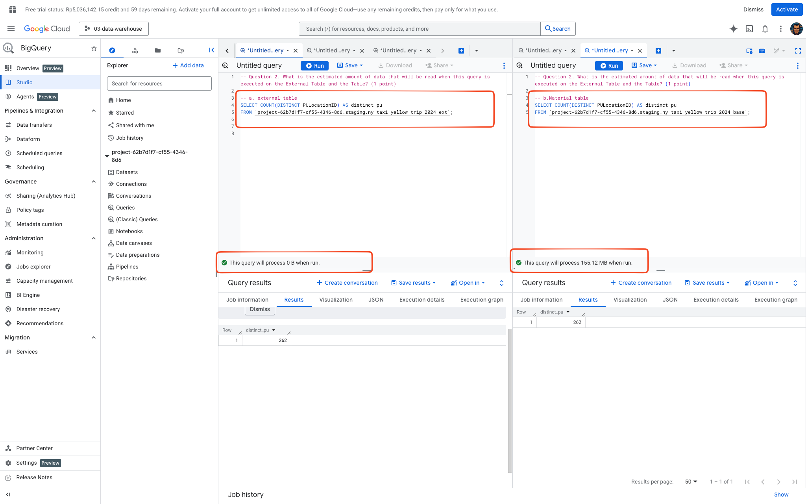
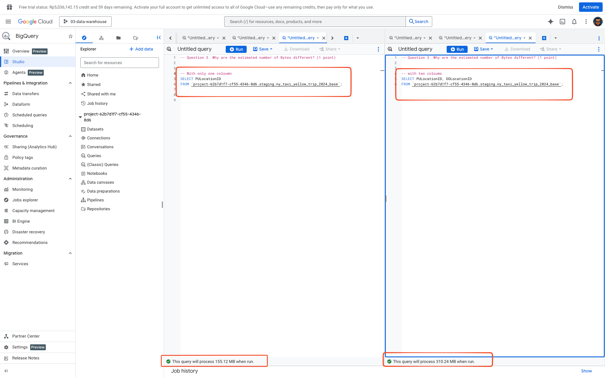
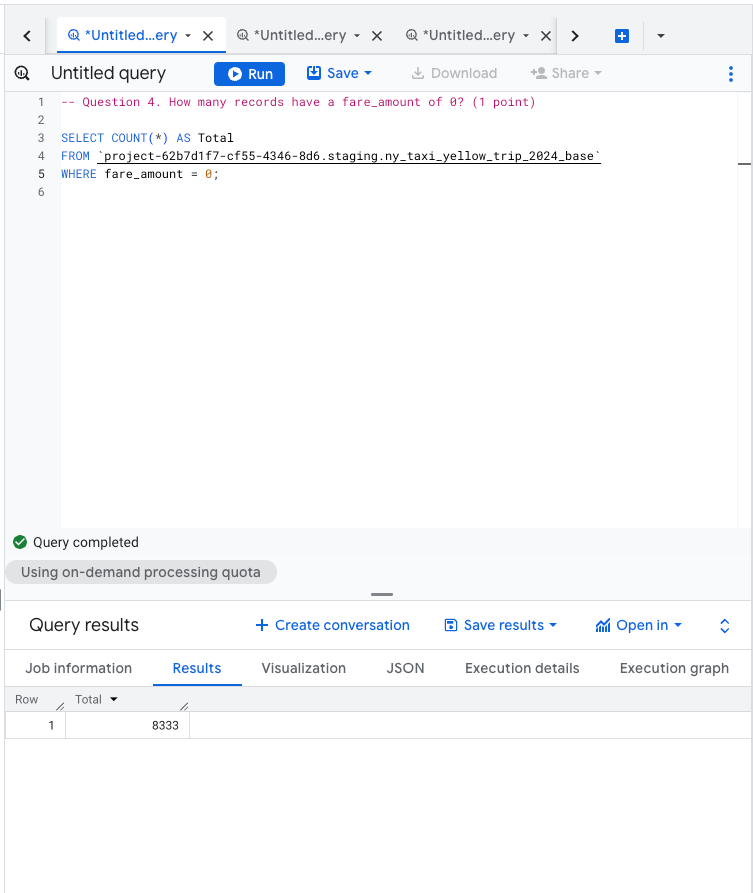
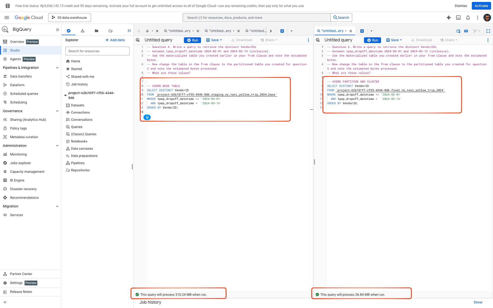

<div align="center">

# Module 03 — Data Warehouse (GCS + BigQuery) — NYC Taxi (Yellow 2024)
## Previous modules: [Module 01 ingestion pipeline](../01-docker-terraform/) · [Module 02 orchestration](../02-workflow-orchestration/)


</div>

<br/>

This module builds a simple Data Warehouse workflow on GCP using **GCS + BigQuery** and **Terraform**.

<div align="center">

**download → GCS (raw parquet) → BQ external (hive partition) → BQ base (materialized) → BQ final (partition + cluster)**  
_Final table is partitioned by `tpep_dropoff_datetime` and clustered by `VendorID`._

</div>

---

## Contents

- [Project structure](#project-structure)
- [Prerequisites](#prerequisites)
- [Configuration](#configuration)
- [Quick start](#quick-start)
- [Running the pipeline](#running-the-pipeline)
- [Access](#access)
- [Services overview](#services-overview)
- [SQL scripts](#sql-scripts)
- [Verification](#verification)
- [Troubleshooting](#troubleshooting)
- [Data source](#data-source)
- [Homework evidence](#homework-evidence)

---

## Project structure

```md
03-data-warehouse/
├── README.md
├── .env.example
├── main.py
├── apps/            # CLI subcommands (download_to_gcs, run_sql)
├── infra/terraform/ # Terraform for GCS + BigQuery datasets
├── sql/             # SQL scripts (external/base/final + homework)
├── src/dw03/        # Python package
├── homework/        # screenshots
└── decisions/       # ADRs
```

---

## Prerequisites

* GCP project with BigQuery + GCS enabled
* Terraform
* Python (managed via `uv`)
* Google Cloud authentication (ADC) for BigQuery/GCS access

---

## Configuration

### 1) Create `.env`

```bash
cp .env.example .env
```

### 2) Key environment variables

#### GCP / Storage

* `GCP_PROJECT_ID`
* `GCS_BUCKET_NAME`
* `GCS_RAW_PREFIX` (e.g. `raw/ny_taxi`)
* `TAXI_COLOR` (e.g. `yellow`)
* `TAXI_YEAR` (e.g. `2024`)
* `MONTHS` (e.g. `01,02,03,04,05,06`)

#### BigQuery

* `BQ_DATASET_STAGING` (e.g. `staging`)
* `BQ_DATASET_FINAL` (e.g. `final`)
* `BQ_TABLE_EXT` (external table name)
* `BQ_TABLE_BASE` (materialized table name)
* `BQ_TABLE_FINAL` (optimized table name)

---

## Quick start

```bash
# 1) create env file
cp .env.example .env

# 2) provision GCP resources (bucket + datasets)
cd infra/terraform
terraform init
terraform apply
cd ../..

# 3) show config
uv run python main.py show-config

# 4) download to GCS
uv run python main.py download-to-gcs

# 5) create tables (external → base → final)
uv run python main.py run-sql --file sql/01_create_external_table.sql --execute
uv run python main.py run-sql --file sql/02_create_base_table.sql --execute
uv run python main.py run-sql --file sql/03_create_optimized_table.sql --execute
```

---

## Running the pipeline

### 1) Download → stream to GCS

```bash
uv run python main.py download-to-gcs
```

Expected layout:

```text
gs://<bucket>/<raw_prefix>/yellow/
  year=2024/month=01/*.parquet
  year=2024/month=02/*.parquet
  ...
  year=2024/month=06/*.parquet
```

### 2) Run SQL (dry-run → execute)

```bash
uv run python main.py run-sql --file sql/01_create_external_table.sql --dry-run
uv run python main.py run-sql --file sql/01_create_external_table.sql --execute

uv run python main.py run-sql --file sql/02_create_base_table.sql --dry-run
uv run python main.py run-sql --file sql/02_create_base_table.sql --execute

uv run python main.py run-sql --file sql/03_create_optimized_table.sql --dry-run
uv run python main.py run-sql --file sql/03_create_optimized_table.sql --execute
```

### 3) Sanity + homework queries

```bash
# sanity checks (multi-statement supported)
uv run python main.py run-sql --file sql/00_dataset_sanity.sql --execute

# homework queries
uv run python main.py run-sql --file sql/04_homework_queries.sql --execute
```

---

## Access

* **BigQuery UI:** Google Cloud Console → BigQuery

Tables created:

* `staging.<BQ_TABLE_EXT>` (external / hive partitioned)
* `staging.<BQ_TABLE_BASE>` (materialized)
* `final.<BQ_TABLE_FINAL>` (partitioned + clustered)

---

## Services overview

| Component          | Purpose                                   |
| ------------------ | ----------------------------------------- |
| GCS                | Raw parquet storage (partitioned folders) |
| BigQuery (staging) | External table + base materialized table  |
| BigQuery (final)   | Optimized table (partition + cluster)     |
| Terraform          | Provision bucket + datasets               |
| Python CLI (uv)    | Download to GCS + run SQL scripts         |

---

## SQL scripts

| File                                | Purpose                                  |
| ----------------------------------- | ---------------------------------------- |
| `sql/01_create_external_table.sql`  | Create hive-partitioned external table   |
| `sql/02_create_base_table.sql`      | Materialize external → base table        |
| `sql/03_create_optimized_table.sql` | Create final partitioned+clustered table |
| `sql/00_dataset_sanity.sql`         | Sanity checks (multi-statement)          |
| `sql/04_homework_queries.sql`       | Homework queries (Q1–Q8)                 |

---

## Verification

### Verify partition coverage (external)

```sql
SELECT year, month, COUNT(*) AS c
FROM `{{GCP_PROJECT_ID}}.{{BQ_DATASET_STAGING}}.{{BQ_TABLE_EXT}}`
GROUP BY 1,2
ORDER BY 1,2;
```

### Verify partitions exist (final)

```sql
SELECT partition_id, total_rows
FROM `{{GCP_PROJECT_ID}}.{{BQ_DATASET_FINAL}}`.INFORMATION_SCHEMA.PARTITIONS
WHERE table_name = '{{BQ_TABLE_FINAL}}'
ORDER BY partition_id
LIMIT 30;
```

---

## Troubleshooting

### 1) BigQuery UI shows "Partitioned" on the external table

If Hive partitioning is enabled, BigQuery may display the external table as "Partitioned".
This is expected. Confirm it is external by checking **External Data Configuration** in the **Details** panel
(Source URI points to `gs://...` and Source format is `PARQUET`).

### 2) `region-us.INFORMATION_SCHEMA.*` Access Denied

Some environments restrict querying region-level metadata views.
Use dataset-level `INFORMATION_SCHEMA` instead:

* `...FROM {{GCP_PROJECT_ID}}.{{BQ_DATASET_STAGING}}.INFORMATION_SCHEMA.TABLES`
* `...FROM {{GCP_PROJECT_ID}}.{{BQ_DATASET_FINAL}}.INFORMATION_SCHEMA.PARTITIONS`


### 3) Dry-run shows `estimated_bytes=0`

This is normal for DDL statements (e.g., `CREATE` or `CREATE OR REPLACE`) because they do not scan data—they only define the schema.

### 4) `Unrecognized name: _PARTITIONDATE`

`_PARTITIONDATE` exists only for ingestion-time partitioned tables.
For column-based partitioning (e.g., `PARTITION BY DATE(tpep_dropoff_datetime)`), query the metadata view:

```sql
SELECT partition_id, total_rows
FROM `{{GCP_PROJECT_ID}}.{{BQ_DATASET_FINAL}}`.INFORMATION_SCHEMA.PARTITIONS
WHERE table_name = '{{BQ_TABLE_FINAL}}'
ORDER BY partition_id
LIMIT 30;
```

### 5) Multi-statement SQL files fail

If a script fails with syntax errors around semicolons, ensure the runner supports splitting statements.
This repo handles it via statement splitting in `src/dw03/pipelines/bq_run_sql.py`.


---

> ## **⚠️ NOTE: Clean up resources**
>
> ### Don't forget to destroy GCP resources after finishing the module to avoid **blowing up** your billing charges! 💸
>
> ```bash
> cd infra/terraform
> terraform destroy
> ```

---

## Homework evidence

Screenshots are stored in [`homework/`](homework).

### BigQuery table details

**External table (hive partitioning)** 

**Final table (partition + cluster)** 

### Answers

| Question | Evidence                                                                                 |
| -------: | ---------------------------------------------------------------------------------------- |
|       Q1 |  |
|       Q2 |  |
|       Q3 |  |
|       Q4 |  |
|       Q6 |  |

---

## Course & Acknowledgment

This project is part of the **Data Engineering Zoomcamp** by [DataTalks.Club](https://datatalks.club).

A huge thank you to the DataTalks.Club team! This is arguably the **best free resource** available for learning the modern Data Engineering stack (Docker, Terraform, Airflow, BigQuery, Spark, dbt). The content is high-quality, practical, and completely open-source.

👉 **Highly recommended! Star the repo & join here:** [https://github.com/DataTalksClub/data-engineering-zoomcamp](https://github.com/DataTalksClub/data-engineering-zoomcamp)

